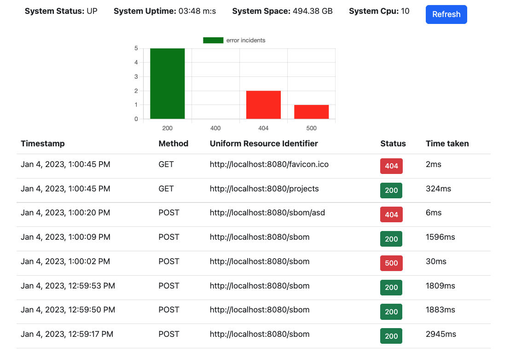

# SpringbootActuatorDashboard

This tool is designed to help developers and administrators monitor the performance and health of their spring boot application using actuator. It tracks various metrics related to requests made to the application, including the request method and URI, the response status, and the time taken to process each request. In addition to displaying this information in a simple, easy-to-read format, the tool also includes a graph that visualizes these metrics over time, allowing users to easily spot trends and identify any potential issues. Additionally, the tool provides various other health status indicators for the application, such as its current resource usage and any errors or issues that have been detected. This information can be valuable for identifying and addressing performance bottlenecks, optimizing resource utilization, and ensuring the overall stability and reliability of the application.

## Installation and configuration

1. Clone the repository and leave a star.
2. Make sure you have `node` and `angular cli` installed
3. If ur using spring boot actuator with `spring boot >= 3.0.0` make sure to check the uris in `src/app/services/dashboard.service.ts`
4. Change the `src/environments/environment.ts` `serverUrl` to the Url of your spring boot application
5. Run the springboot-actuator-dashboard with `ng serve`
7. Go to `http://localhost:4200`
